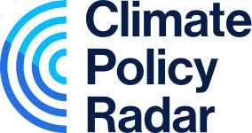

# Climate Policy Radar's Global Stocktake Explorer

This is the repository for the [Global Stocktake Explorer](https://gst.climatepolicyradar.org), a tool for exploring the documents submitted as part of the UNFCCC Global Stocktake.

This repository contains code and documentation. **We will be publishing machine-readable versions of the documents submitted as part of the Global Stocktake in due course.**

## Documentation

This repository contains the following documentation:

- [Main documentation](./docs/README.md)
- [Methodologies and metrics for each concept](./docs/concept-specific-methodologies/)

_Note: The notebooks may not work as they are only compatible with pydantic version 1.x._

## About Climate Policy Radar

Climate Policy Radar is a not-for-profit climate startup on a mission to organise, analyse and democratise data on climate law and policy using augmented intelligence – a human-centered partnership model of people and AI.

We build open and free tools to help discover, understand and generate data-driven climate law and policy insights. You can find out more about us at [climatepolicyradar.org](https://climatepolicyradar.org).
